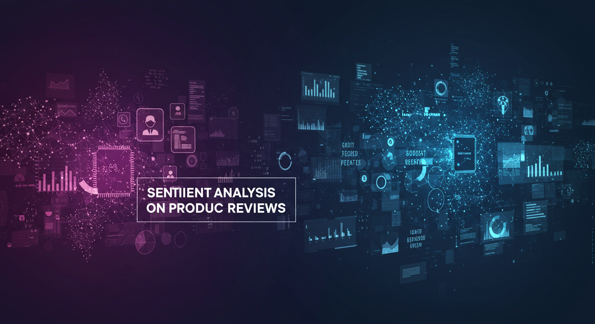
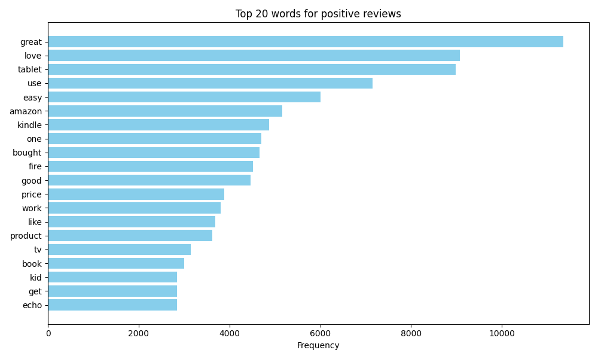
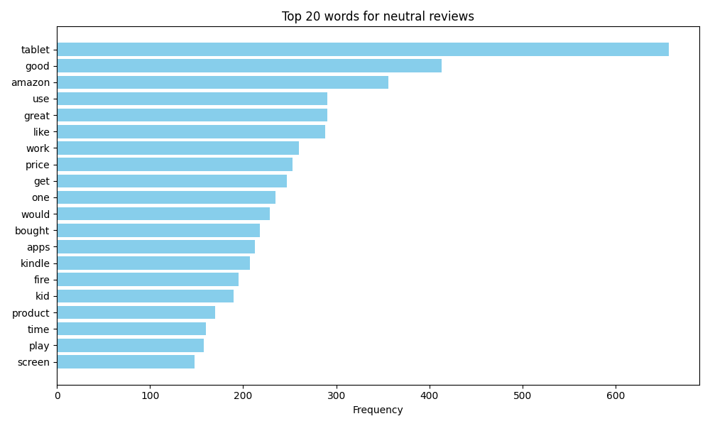
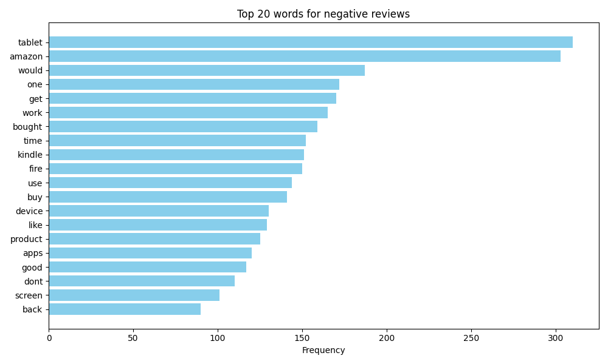

# Sentiment Analysis on Product Reviews




## 🚀 Project Overview
This project analyzes product reviews to classify sentiment (**positive, neutral, negative**) and extract key aspects (**delivery, price, packaging**) to provide actionable business insights.  

## 🚀 Live Dashboard

<p align="center">
  <a href="https://sentiment-analysis-dashboard-ksmysuf74i3inpmnkhpico.streamlit.app/" target="_blank">
    
  </a>
</p>


## 🌐 Connect with Me

<p align="center">
  <a href="https://your-portfolio-website.com" target="_blank">
    
  </a>
  &nbsp;&nbsp;
  <a href="https://www.linkedin.com/in/your-linkedin-profile/" target="_blank">
    
  </a>
</p>


**Goals:**  
- Classify customer reviews into **positive, neutral, or negative** sentiment.  
- Perform **aspect-based sentiment analysis** (e.g., “delivery fast but packaging poor”).  
- Provide **visual insights** for product improvement and business decisions.

---

## 📂 Dataset
- **Source:** [Kaggle – Consumer Reviews of Amazon Products](https://www.kaggle.com/datasets/datafiniti/consumer-reviews-of-amazon-products)  
- **Size:** ~34,600 reviews  
- **Key Columns:**
  - `reviews.text` – customer review text  
  - `reviews.rating` – 1 to 5 star rating  
  - `sentiment` – mapped from ratings: positive, neutral, negative  

**Example Reviews:**
- **Positive:** “Easy to use, love getting everything streamed fast.”  
- **Neutral:** “Smart commercial show, can’t answer a lot of questions.”  
- **Negative:** “First got it, great. Stopped charging, wouldn’t turn back on.”

---

## 🧹 Data Preparation
- Removed stopwords, punctuation, and special characters  
- Converted text to lowercase  
- Lemmatization applied for word normalization  
- Cleaned dataset saved as `data/cleaned_reviews.csv`  

**Sentiment Distribution:**  
| Sentiment | Count |
|-----------|-------|
| Positive  | 32,315 |
| Neutral   | 1,499  |
| Negative  | 812    |

---

## 📊 Exploratory Data Analysis
- Word frequency per sentiment  
- Rating distribution vs sentiment  
- Top positive and negative words & features  

**Top Positive Words:** `love, great, easy, perfect, excellent`  
**Top Negative Words:** `returned, slow, disappointed, waste, cannot`  

---

## ⚙️ Modeling
**Baseline Model:** Logistic Regression with TF-IDF vectorization  
- Train/Test split: 80/20  
- Balanced classes with **SMOTE** to improve neutral/negative recall  
- Tuned hyperparameters for optimized performance  

**Baseline Accuracy:** ~86%  
**Tuned + SMOTE Accuracy:** ~88%  

**Key Feature Importance:**  
- Positive: `love, great, easy use`  
- Negative: `returned, slow, disappointed`  

---

## 📝 Aspect-Based Sentiment Analysis
- Extracted aspects from reviews (delivery, price, packaging, usability, performance)  
- Calculated sentiment per aspect  
- Saved results in `data/aspect_level_sentiment.csv`  

**Example:**  
| review_index | aspect        | aspect_sentiment |
|--------------|---------------|----------------|
| 0            | delivery      | positive       |
| 5            | packaging     | negative       |
| 12           | usability     | positive       |

---

## 📈 Dashboard (Streamlit)
Features:
- Interactive sentiment distribution  
- Aspect-based sentiment analysis visualization  
- Word clouds of top positive/negative words  
- Downloadable CSV insights  

## 💻 Live Demo

<p align="center">
  <a href="https://sentiment-analysis-dashboard-ksmysuf74i3inpmnkhpico.streamlit.app/" target="_blank">
    
  </a>
</p>


---
## 📊 Visuals / Dashboard Preview

### 1. Sentiment Distribution

*Shows how reviews are distributed among positive, neutral, and negative categories.*

---

### 2. Top Words by Sentiment

<p align="center">
  
  
  
</p>


---

### 3. Aspect-level Sentiment Insights

*Highlights sentiment for different aspects like delivery, price, packaging, etc.*

---

### 4. Example Streamlit Dashboard

*Interactive dashboard with filters, sentiment visualizations, and aspect insights.*

---

## 📊 Business Recommendations Based on Findings

Based on the sentiment and aspect-level analysis of Amazon product reviews, here are actionable insights for improving customer satisfaction and business performance:

---

### 1. Delivery & Shipping
- **Positive mentions:** Customers praise fast delivery and reliable shipping.
- **Negative mentions:** Occasional complaints about delays or missing items.
- **Recommendation:** 
  - Highlight fast delivery in marketing campaigns.  
  - Review logistics partners and optimize tracking & delivery communications.

---

### 2. Product Quality & Packaging
- **Positive mentions:** Durable products, good build quality.
- **Negative mentions:** Packaging issues, damaged items during transit.
- **Recommendation:** 
  - Improve packaging materials and handling.  
  - Introduce quality control checks before shipping.

---

### 3. Customer Support
- **Negative mentions:** Returns, refunds, and support responses often cited as slow or unhelpful.
- **Recommendation:** 
  - Enhance customer support response times.  
  - Provide clear return/refund instructions and proactive assistance.

---

### 4. Pricing & Value
- **Positive mentions:** “Worth the price,” “good value for money.”
- **Recommendation:** 
  - Reinforce value proposition in product descriptions and promotions.  
  - Consider bundling or discount offers to increase customer satisfaction.

---

### 5. Features & Usability
- **Positive mentions:** Easy to use, simple setup, fun features.
- **Negative mentions:** Confusing interfaces, slow or unresponsive features.
- **Recommendation:** 
  - Highlight ease-of-use in marketing.  
  - Review UX/UI improvements for problematic features.  

---

### 6. Visual Insights (Optional)
You can include charts to support these recommendations:  
- Bar charts of **aspect-level sentiment** (positive vs negative counts).  
- Word clouds highlighting top positive and negative terms per aspect.  


---

> 💡 **Key takeaway:** Focusing on delivery speed, packaging quality, customer support, and clear value communication can significantly improve overall customer satisfaction and reduce negative sentiment.


## 🛠 Tech Stack
- Python 3.10+  
- Libraries: `pandas, numpy, scikit-learn, nltk, matplotlib, seaborn, wordcloud, joblib, streamlit`  
- TF-IDF Vectorization  
- Logistic Regression (baseline)  
- SMOTE oversampling  

---

## 💡 Business Relevance
- Helps companies identify **what customers love or dislike**  
- Highlights **critical aspects** like delivery speed, packaging quality, product usability  
- Guides data-driven **product improvement and marketing strategies**

---

## 📂 Project Structure

sentiment-analysis/

│

├─ data/

│ ├─ cleaned_reviews.csv

│ └─ aspect_level_sentiment.csv

│

├─ models/

│ ├─ logreg_tuned.joblib

│ └─ tfidf_vectorizer_tuned.joblib

│

├─ src/

│ ├─ text_cleaning.py

│ ├─ vectorize_tfidf.py

│ ├─ train_baseline.py

│ ├─ train_baseline_smote.py

│ ├─ train_baseline_tuned.py

│ ├─ aspect_extraction.py

│ └─ aspect_sentiment.py

│

├─ streamlit_app.py

├─ requirements.txt

└─ README.md


---

## 📌 How to Run Locally

1. **Clone the repository:**
```bash
git clone [https://github.com/yourusername/sentiment-analysis-dashboard](https://github.com/Ayolalekan/sentiment-analysis-dashboard).git
cd sentiment-analysis-dashboard
```
## Install dependencies:
```bash
pip install -r requirements.txt
```
## Run the Streamlit app:
```bash
streamlit run streamlit_app.py
```

## 👏 Acknowledgements

Dataset: Datafiniti – Consumer Reviews of Amazon Products

Python Libraries: scikit-learn, nltk, pandas, streamlit

Inspiration: Portfolio-ready NLP projects for AI-driven business insights

